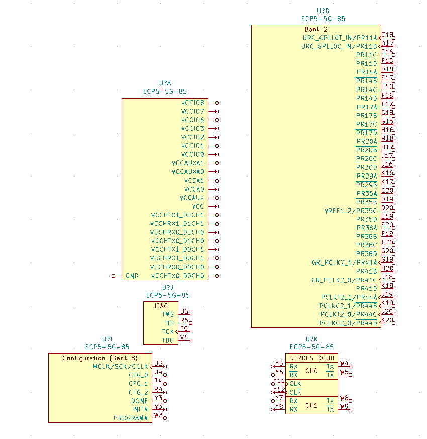
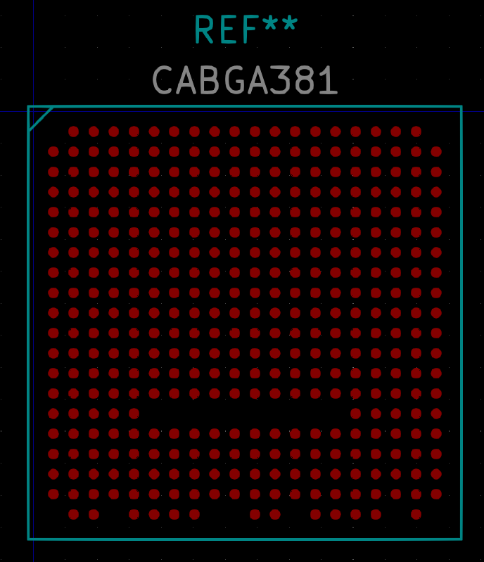

# ECP5-Utils
Utilities for the ECP5 FPGA

## pinout_parser.py
Shows the pinout based on [ECP5 pinout CSV files](https://www.latticesemi.com/Products/FPGAandCPLD/ECP5).
It can also generate KiCad module / footprints and symbols.
WARNING: Only 0.8 mm pitch packages supported for footprint generation.

